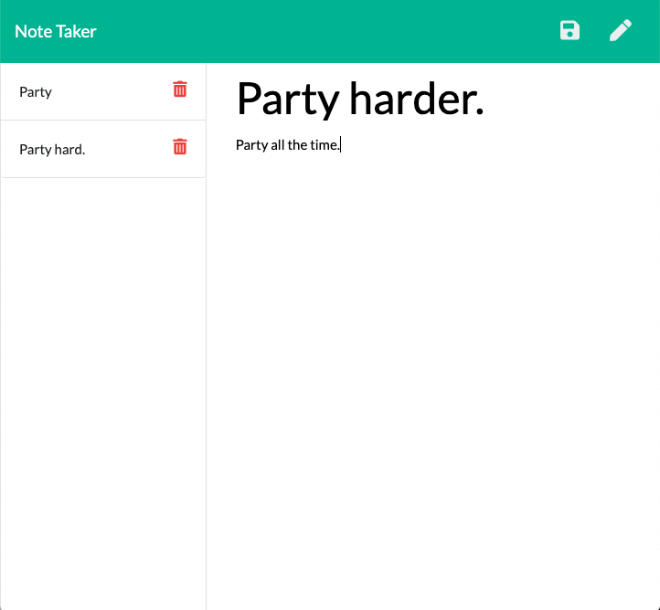

# Note Taker 

[](https://lit-reef-93078.herokuapp.com/)

[Link to deployed application on Heroku](https://lit-reef-93078.herokuapp.com/)

## Description

Welcome to Note Taker: An application that can be used to write and save notes. This application uses an Express.js back end and saves and retrieves note data from a JSON file.


## Installation

The Note Taker uses the Express package. To install, run: 

```
npm i
```

## Usage

Clone or fork this repo if you would like. Run the following to start the server:
```
node server.js
```
Open your browser at localhost:3001. You may add a note title and description, save notes or delete notes.

## License

This application is covered under the MIT license.

## Contributing

Submit a pull request if you would like to contribute.

## Questions
Feel free to email me at seandoesitbetter@gmail.com with any questions.

Check out my GitHub profile: [seanc0ne](https://www.github.com/seanc0ne)